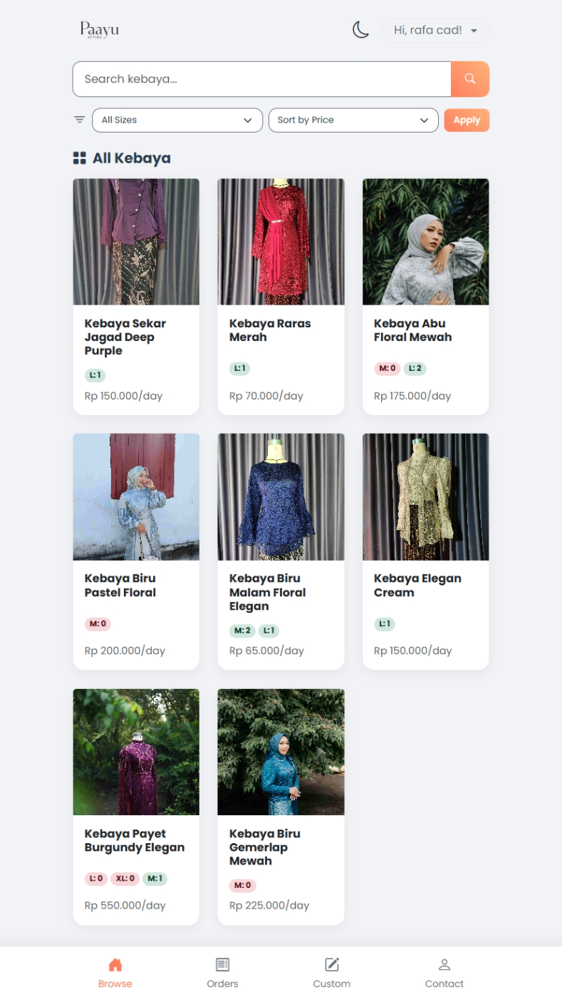

<p align="center">
    <a href="https://laravel.com" target="_blank">
        
    </a>
    <h1 align="center" style="font-family: 'Poppins', sans-serif;">Paayu Attire</h1>
    <p align="center"><b>Modern Rental & Management System for Kebaya and Attire</b></p>
</p>

<p align="center">
    
    
    
    
    
</p>

---

## ✨ Fitur Utama
- 🎟️ **Sistem Sewa Modern**: Booking, checkout, denda otomatis, validasi, dan histori transaksi.
- 🔒 **Google Login & Unlink**: Integrasi login Google, unlink, dan pengelolaan password.
- 👤 **Manajemen Profil**: Edit profil & password langsung di satu halaman.
- 🛡️ **Admin Panel**: Filament-powered, status transaksi sinkron, denda bisa diatur admin.
- 📱 **Responsive UI**: Bootstrap 5, custom main.css, dan font Poppins.
- 🖼️ **Upload Bukti & Komentar**: Upload bukti pembayaran dan gambar di komentar.
- 📊 **Laporan**: Export Excel (opsional, jika diaktifkan).

## 🛠️ Tech Stack
| Komponen        | Teknologi                           |
|-----------------|-------------------------------------|
| **Framework**   | Laravel 12                          |
| **Frontend**    | Bootstrap 5, main.css, Poppins      |
| **Admin Panel** | Filament 3                          |
| **Auth**        | Google OAuth, Laravel Auth          |
| **Database**    | MySQL 8                             |

## 📞 Kontak
<div align="center">
    <a href="mailto:paayuattire@gmail.com">
        
    </a>
    <a href="https://instagram.com/paayuattire">
        
    </a>
</div>

## 🖼️ Screenshot Aplikasi
<p align="center">
    
</p>

## 🚀 Instalasi
```bash
# Clone repository
git clone https://github.com/yourusername/paayu-attire.git
cd paayu-attire

# Install dependencies
composer install
npm install

# Setup environment
cp .env.example .env
php artisan key:generate

# Konfigurasi database di .env
DB_CONNECTION=mysql
DB_HOST=127.0.0.1
DB_PORT=3306
DB_DATABASE=paayu_attire
DB_USERNAME=root
DB_PASSWORD=

# Jalankan migrasi & seeder
php artisan migrate --seed

# Compile asset
npm run build

# Jalankan server
php artisan serve
```

## License
MIT
